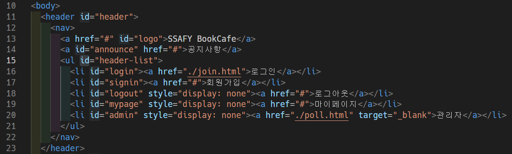
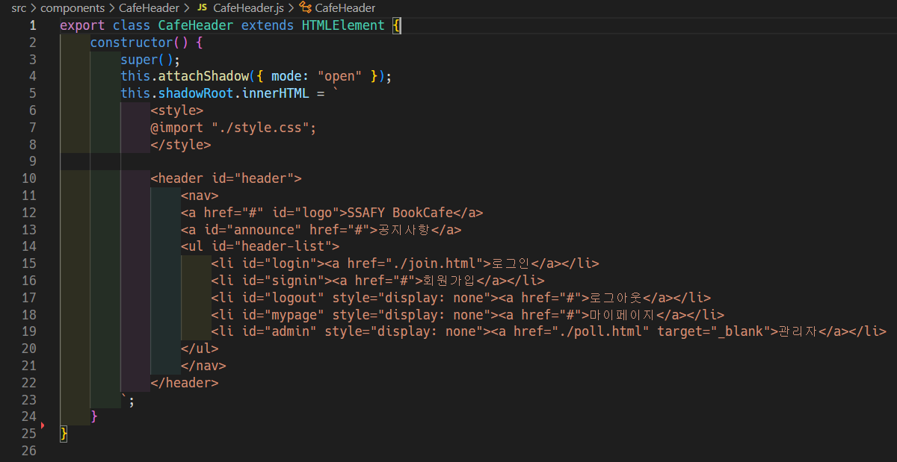
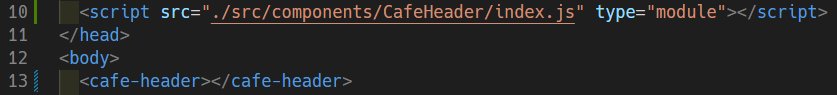

## HTML Web Component를 이용한 게시판 구현

---

### 목표

---

- 프론트엔드 라이브러리를 사용하지 않고 웹 페이지 구현
- [Custom Element](https://developer.mozilla.org/en-US/docs/Web/Web_Components/Using_custom_elements)를 이용하여 React처럼 HTML 요소들을 컴포넌트화

### 예시

---

#### 리펙터링 전

#### 리펙터링 후

- Custom Element 선언 \
  
- Custom Element 사용 \
  

### 프로젝트 시작 방법

---

레포를 클론한 후 vscode의 [Live Server](https://marketplace.visualstudio.com/items?itemName=ritwickdey.LiveServer) 확장을 이용해 실행한다.

> [JavaScript Module](https://developer.mozilla.org/en-US/docs/Web/JavaScript/Guide/Modules)을 사용하기 때문에 로컬이 아닌 서버에서 테스트 해야 한다. 로컬에서 시작하면 CORS 오류가 발생한다.
